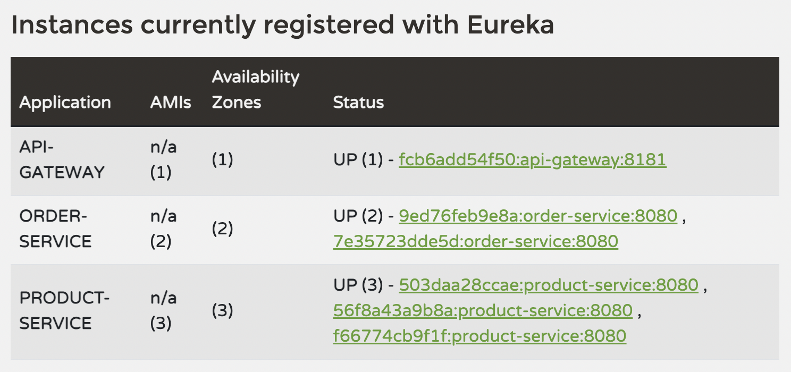

## Building required images to the Docker daemon
> Make sure you have a running [Docker](https://www.docker.com/) environment on your system.

Building, compiling, and testing each microservice is handled by Maven. Compiling each microservice into a docker image and pushing it to the local docker daemon is also handled by Maven through Google's JIB plugin. 

To compile each microservice and then push the images to the local docker daemon, run the following command from the root of the repository `/storefront`:

```
$ mvnw clean install jib:dockerBuild
```

If you run the following docker command you shoud see 4 new images listed out:
```
$ docker images
...
registry.hub.docker.com/moomba/product-service     latest
registry.hub.docker.com/moomba/api-gateway         latest
registry.hub.docker.com/moomba/discovery-service   latest
registry.hub.docker.com/moomba/order-service       latest
...
```


## Routing keycloak to localhost
Due to time constraints, no reverse proxy for KeyCloak has been set up. Because of this, we have to reroute any request to the "keycloak" host to our localhost address in a more basic manner. This basic rerouting will allow the `api-gateway` service to redirect us to the keycloak login page properly.

Below are the instructions for each platform:

### MacOS
Add the following line to your `"/etc/hosts"` file:
```
127.0.0.1   keycloak
```

### Windows
Add the following line to your `"C:\Windows\System32\Drivers\etc\hosts"` file:
```
127.0.0.1   keycloak
```

## Running
To bring up all the containers with replication on crucial ones, run the following command:
```
$ docker-compose up -d --scale product-service=3 --scale order-service=3
```

You should see all the containers being started one by one:
```
[+] Running 14/14
 ⠿ Network storefront_default              Created
 ⠿ Container mongo-product-service         Started
 ⠿ Container postgres-keycloak             Started
 ⠿ Container postgres-order-service        Started
 ⠿ Container zipkin                        Started
 ⠿ Container discovery-service             Started
 ⠿ Container keycloak                      Started
 ⠿ Container api-gateway                   Started
 ⠿ Container storefront-order-service-3    Started
 ⠿ Container storefront-order-service-1    Started
 ⠿ Container storefront-order-service-2    Started
 ⠿ Container storefront-product-service-3  Started
 ⠿ Container storefront-product-service-1  Started
 ⠿ Container storefront-product-service-2  Started
```

The startup time may vary from system to system, but usually, it's good to give it around 2 minutes.\
To verify that the system is up, head over to [`http://localhost:8181/eureka/web`](http://localhost:8181/eureka/web) and confirm that all the microservices are up.
When asked to log in with KeyCloak, input `"test"` as both the username and password, and then submit.\
After this, you should be redirected back to the eureka dashboard, and the following should now be visible:

